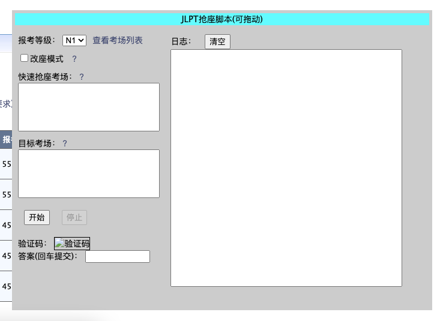
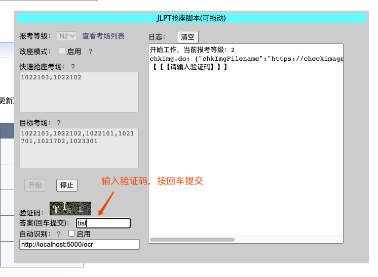
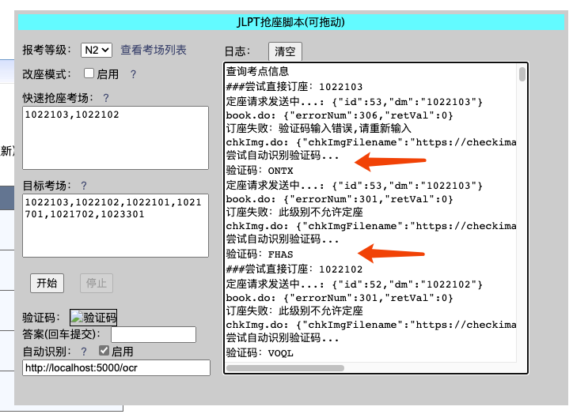
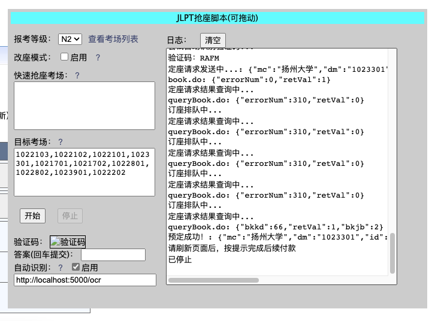

# 日本语能力测试（JLPT）抢座脚本

这个脚本会调用网站原本的一些方法来实现ajax请求，但去除了ui的各种操作，以便更快的轮询和发起请求。

如果这个脚本有帮到你的话，麻烦给个star吧。

**一緒に散歩しましょう**

---

## 脚本界面



- 界面上的参数修改之后，会自动保存到localStorage。

- 报考的等级
    - 字面意思

- 证件号和密码
    - 为防止中途发生出现会话已过期之类的错误，在这里填入证件号和密码，则可以自动重新登录。
    - 如果不放心，也可以不填。则需要先手动登录，再开启脚本。且中途遇到会话过期，则会终止脚本。

- 改座模式
    - 用于订座成功之后进行改座。
    - 订座成功后有且仅有一次改座机会。
    - 改座失败不影响当前订座。
    - 目标考场不要包含已报考场。

- 快速抢座考场
    - 填写考点代号，用英文逗号分隔，例如：`1020101,1020103,1020105`。
    - 因为在人多的时候，查询接口会卡。而第一天往往所有考场都是有座位的，所以可以跳过查询直接订座。
    - 可以在这里填写考场，会自动卡时间，2点开始，按照顺序尝试直接订座。
    - 注意每次订座都需要消耗验证码。

- 目标考场
    - 填写考点代号，用英文逗号分隔，例如：`1020101,1020103,1020105`。
    - 会通过接口去查询哪个有空座，然后按照列表的优先顺序选择有空座的考场。

- 超时设置
    - 查询请求超时：用于查询请求以及验证码之类的请求超时。
    - 订座请求超时：用于登录请求和订座请求的超时。
    - 轮询请求间隔：控制多长时间查询一次空余考位（服务器有限流，小于500ms可能会导致请求报400）。

- 开始/停止按钮
    - 字面意思

- 验证码显示和输入
    - **每次订座请求都会消耗掉验证码，一旦订座失败，会立刻请求新的验证码。请注意迅速输入，以免因此耽误时间。**
    - 不用关心大小写。
    - 在输入框按回车提交。
    - 如果看不清，不输入或输入小于4个字符，回车提交，都会请求新的验证码。
    - 这里刷出验证码之后，不要在原来的界面上刷新验证码。

- 验证码自动识别
    - 需要参考后面的说明，搭建自动识别验证码的服务。
    - 自动识别准确率有限，网络高峰期可能导致刷新验证码较慢。

- 日志显示
    - 显示过程中的日志。
    - 如果觉得窗口小，console控制台也会有一样的输出。

## 验证码自动识别

- 验证码识别采用ddddocr库来实现，准确率大概60%左右。

    - 有关库本身的的问题，请移步 https://github.com/sml2h3/ddddocr
    - 也可以采用自行采用其他库，或者在线API服务。

- 准备`python3`环境

- 安装依赖
    ```
    pip3 install -r requirements.txt
    ```

    - 如果下载速度太慢，可以换国内源
    ```
    pip3 config set global.index-url https://pypi.tuna.tsinghua.edu.cn/simple
    ```

- 运行，确认输出正常无报错
    ```
    python3 captcha.py
    ```

- 如果是Mac M1/M2芯片，需要以x86_64架构运行python，在命令前面加上`arch --arch=x86_64`即可
    ```
    arch --arch=x86_64 python3 captcha.py
    ```

- 如果遇到报错`DdddOcr.init() got an unexpected keyword argument 'beta'`，可能是ddddocr版本问题，检查是否1.4.7版本。实在不行，可以把beta参数去掉。

## 使用方法

- 浏览器打开 <https://jlpt.neea.cn/index.do>

- F12打开控制台，会因为无限循环的debugger而进入断点调试。取消断点（Deactivate breakpoints），然后恢复运行（Resume script execution）。

    

- 来到Console界面，将`jlpt.js`所有代码粘贴进去，回车，界面上出现窗口。

- 如果不使用自动登录功能，请手动先登录进去。如果使用自动登录，则不需要手动登录，只需要在脚本处填写账号密码，脚本会自动处理。

- 调整参数，点击开始。

- 刚运行或者验证码错误/过期之类的，会自动获取一个新的验证码，显示在窗口里。输入验证码答案后，程序继续运行。

    

- 如果用了自动识别，则无需输入，遇到验证码失败或无法识别，会重新尝试。

    


- 程序循环查询考场信息，找到符合目标条件的有座位考场，会立刻发起订座的请求。

    

## 注意事项

- 最好在14:00之前几分钟，登录账号，运行脚本，以防14:00左右卡顿导致登录困难。

- 脚本运行时，页面最好不要操作，以免导致验证码失效。（实际上只需要登录即可，甚至不需要进入到选座界面）

- 报名第一天，因为人多，且座位肯定是有的，可以先尝试快速抢座。

- 第一波没抢到，后续报名日，每天会释放前一天没付款的座位。相对人少，且不确定哪个考场会有座位释放，所以不建议再使用快速抢座，并且最好在目标考场里多给几个周边的备选考场。（不要纠结一定要某个考场，有的时候真的就全定完了，不会释放了）

- 建议提前演练一下，一方面脚本可能有问题，或者网站更新导致功能不可用。

- 如果遇到订座请求（book.do）报400，可能需要注销一下重新登录才能好。
