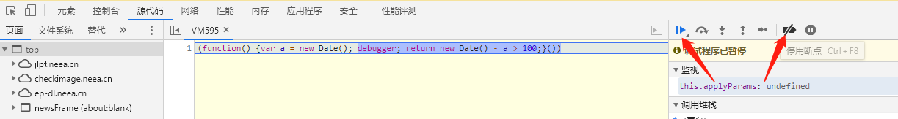
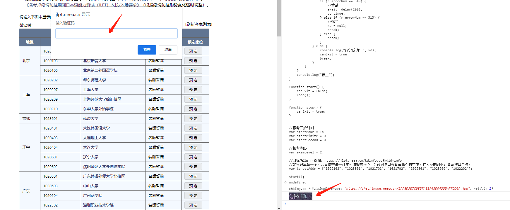
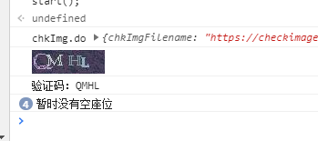
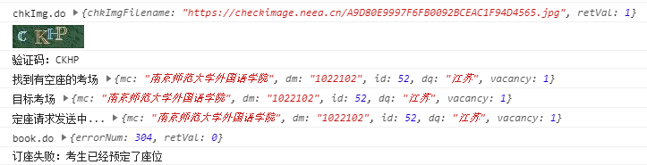

# 日本语能力测试（JLPT）抢座脚本

这个脚本会调用网站原本的一些方法来实现ajax请求，但去除了ui的各种操作，以便更快的轮询和发起请求。

如果这个脚本有帮到你的话，麻烦给个star吧。

**一緒に散歩しましょう**

---

## 需要调整的参数
- 报考的等级
    
    `var examLevel = 2;`

- 是否改座模式

    `var isChangeSeat = false;`

    - 订座成功后有且仅有一次改座机会。改座失败不影响当前订座。

- 目标考场

    `var targetAddr = ["1022101", "1022102"];`
    
    - 可通过 <https://jlpt.neea.cn/kdinfo.do?kdid=info> 查询。

    - **如果只填写一个**，会自动卡时间，在14:00直接尝试去订座。

    - **如果填写了多个**，会不停地通过接口去查询考场信息，按照给定的顺序，优先选择靠前的、有座位的考场。注意在人多的时候，查询接口会卡。

    - 改座模式下，目标考场不要包含已订座的考场。
    

## 使用方法

- 由于需要在控制台显示验证码，chrome和edge等浏览器内核版本较高，已经禁止此功能，导致控制台无法显示图片。**因此建议使用国产浏览器。**

- 浏览器打开 <https://jlpt.neea.cn/index.do>，登录帐号。

- F12打开控制台，会因为无限循环的debugger而进入断点调试。取消断点（Deactivate breakpoints），然后恢复运行（Resume script execution）。
    

- 来到Console界面，将`jlpt.js`所有代码粘贴进去（注意改参数），回车。
    - 刚运行或者验证码错误/过期之类的，会自动获取一个新的验证码，显示在控制台里。并弹出一个输入框，输入验证码答案后，程序继续运行。（不用区分大小写，会自动转大写。如果看不清，直接输入空，会尝试获取新的图片）
    
    
    - **每次订座请求都会消耗掉验证码，一旦订座失败，会立刻请求新的验证码。请注意迅速输入，以免因此耽误时间。**

    - 程序循环查询考场信息，找到符合目标条件的有座位考场，会立刻发起订座的请求。
    
    
    
    
- 一旦开启，在成功订座之前会不停循环。想要停止的话，有以下几种方法：
    - 在验证码输入框内填写exit。
    - 非验证码输入时，在控制台输入`stop()`并回车。
    - 直接关闭网页。

## 注意事项

- 最好在14:00之前几分钟，登录账号，运行脚本。以防14:00左右卡顿导致登录困难。但不要太早登录，否则会超时掉出来重新登录。

- 脚本运行时，页面最好不要操作，以免导致验证码失效。（实际上只需要登录即可，甚至不需要进入到选座界面）

- 报名第一天，因为人多，且座位肯定是有的，可以先尝试下只填一个目标考场，直接去抢座。如果填写多个，可能会因为刷新考场信息卡顿、导致拖延时间。

- 第一波没抢到，后续报名日，每天会释放前一天没付款的座位。相对人少，且不确定哪个考场会有座位释放，所以建议多给几个周边的备选考场。（不要纠结一定要某个考场，有的时候真的就全定完了，不会释放了）

- 建议提前演练一下，一方面脚本可能有问题，或者网站更新导致功能不可用；另一方面，可以熟悉下操作，顺便检查下浏览器是否能在控制台显示出验证码。（360、QQ等国产浏览器测试过ok，chrome、edge等内核版本高的浏览器都不行。这块也懒得去找解决方案了。）

- 如果遇到订座请求（book.do）报400，可能需要注销一下重新登录才能好。